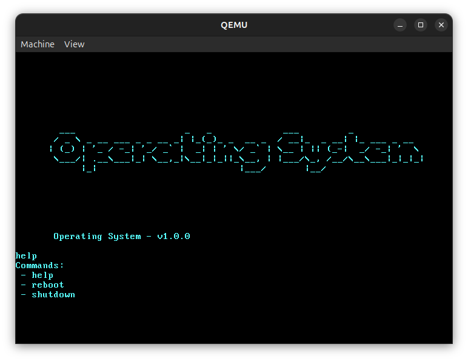

# Operating System

This repository contains the early development of my own simple 32-bit operating system.

It’s a personal learning project exploring low-level programming, system architecture, and how operating systems work under the hood.

The OS is written in C++ and assembly.

## Status

|        | Build Status                                                                                    |
|--------|-------------------------------------------------------------------------------------------------|
| master |  |

## Installation

Install the dependencies:

```bash
sudo apt update
sudo apt install build-essential nasm gcc-multilib g++-multilib grub-pc-bin xorriso mtools qemu-system-x86 qemu-utils
```

Then, build the bootable ISO:

```bash
make install
```

Run the operating system in QEMU:

```bash
qemu-system-x86_64 -cdrom build/operating-system.iso
```

## Preview


## Commands
This operating system is intended for educational purposes only and therefore does not have a serious range of functions.

These are the simple built-in shell commands implemented so far:
- [x] help
- [x] reboot
- [x] shutdown

## License

[GPL](https://github.com/breuerlukas/operating-system/blob/master/LICENSE.md)